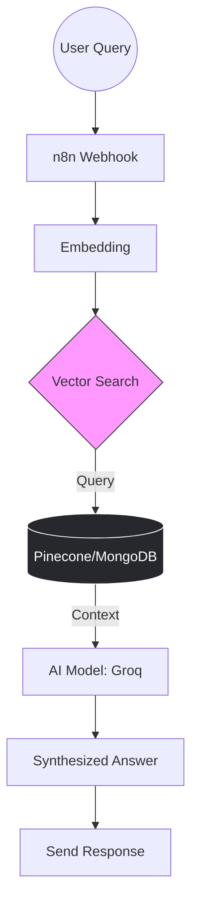

### 📂 Agentic RAG Workflow - Intelligent Knowledge Base

# 🧠 Agentic RAG Workflow

*An advanced AI Agent system that understands user intent and retrieves contextually relevant information from custom databases using Vector Search.*

## 📐 System Architecture

## 🚀 Key Features
**Intent Recognition:** Understands exactly what the user is asking before searching.

**Vector Search:** High-speed retrieval of relevant data chunks from Pinecone.

**Low Latency:** Optimized with Groq for near-instant AI responses.

## 🛠️ Tech Stack
- **Orchestration:**     

- **Vector DB:**  

- **LPU Engine:**  

- **NoSQL:**  
