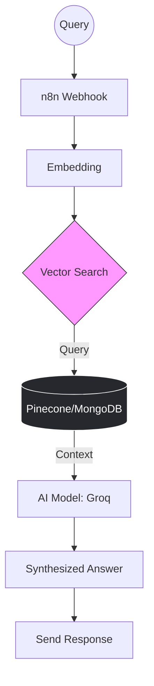

### 📂 Agentic RAG Workflow - Intelligent Knowledge Base

# 🧠 Agentic RAG Workflow

*An advanced AI Agent system that understands user intent and retrieves contextually relevant information from custom databases using Vector Search.*

## 📐 System Architecture

## 🚀 Key Features
Intent Recognition: Understands exactly what the user is asking before searching.

Vector Search: High-speed retrieval of relevant data chunks from Pinecone.

Low Latency: Optimized with Groq for near-instant AI responses.

## 🛠️ Tech Stack
- **Orchestration:**

- **Vector DB:**

- **LPU Engine:**

- **NoSQL:**
